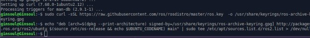
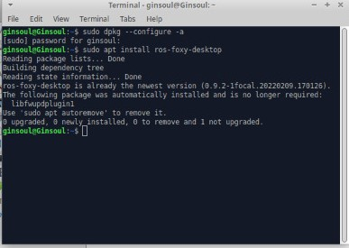
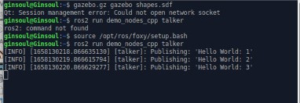
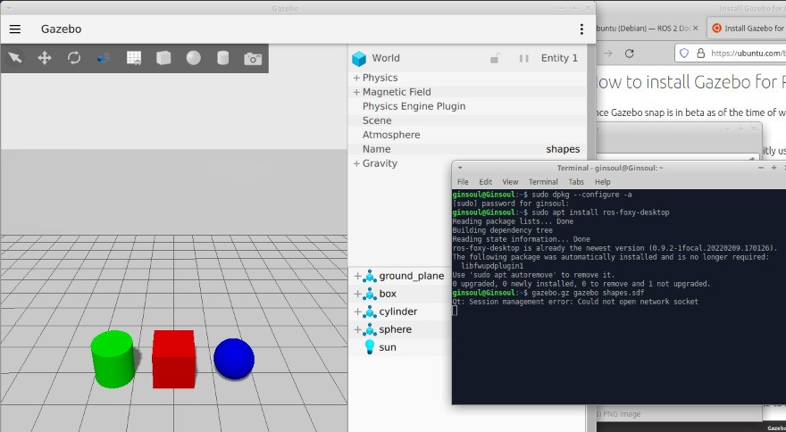

# Install ROS2 
Sub task for first task in robotics and AI path(install ROS OS on Xubuntu 20.4)

## Table of Contents
* [Technologies Used](#technologies-used)
* [Setup](#setup)
* [Screenshots](#Screenshots)
* [Acknowledgements](#acknowledgements)

## Technologies Used
- Xubuntu - version 20.04.4
- VirtualBox - version 6.1.34
- ROS2 
- Gazebo

## Setup
 **  Technologies requierment Installation **
 
First of all you have to install VirtualBox in this link https://www.virtualbox.org/wiki/Downloads

Install Xubuntu Instalation Focal Fossa (20.04): https://xubuntu.org/release/20-04/
 
  **  Setup Steps **
1- Setup your VB and install Ubuntu OS in it by follow this tutorial :https://www.geeksforgeeks.org/how-to-install-ubuntu-on-virtualbox/
2-Install ROS2 OS:
 2.1 Setup your sources.list:
  Add the ROS 2 apt repository to your system 
   
        `sudo apt update && sudo apt install curl gnupg2 lsb-release
         
         sudo curl -sSL https://raw.githubusercontent.com/ros/rosdistro/master/ros.key  -o /usr/share/keyrings/ros-archive-keyring.gpg`
  2.2 add the repository to your sources list
       Setup your computer to accept software from packages.ros.org.
       
        `echo "deb [arch=$(dpkg --print-architecture) signed-by=/usr/share/keyrings/ros-archive-keyring.gpg] http://packages.ros.org/ros2/ubuntu $(source /etc/os-release && echo $UBUNTU_CODENAME) main" | sudo tee /etc/apt/sources.list.d/ros2.list > /dev/null`
        
        
 3- Install ROS 2 packages
   
        `sudo apt install ros-foxy-desktop`
        
 4- Environment setup
    Sourcing the setup script.
   
          `source /opt/ros/foxy/setup.bash`
        
      
Now ROS2 OS are installed in your device and ready to use.

 5- Exaple to test 
   `ros2 run demo_nodes_cpp talker`
   
***Additonal Instalation***
In additional you can instal Gazebo for interface and use for 3D robotics simulator

   `sudo snap install gazebo --channel=citadel/beta`
 After installation, we can execute the freshly installed Gazebo with the command
   `gazebo.gz gazebo`

## Screenshots

1- Add the ROS 2 apt repository

2- Instlattion

3- Example Test

4- Gazebo 

<!-- If you have screenshots you'd like to share, include them here. -->

## Acknowledgements
credit:

- This Tutorial was based on 
- ROS2 Documntation https://docs.ros.org/en/foxy/Installation/Ubuntu-Install-Debians.html#id3.
-  Ubuntu for Gazebo installation https://ubuntu.com/blog/install-gazebo-for-ros-2-in-under-a-minute

